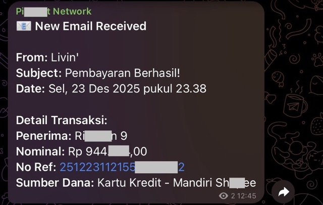

# Email Parser Worker

A Cloudflare Worker that parses incoming emails **Transaction Notification from Livin** using `postal-mime` and forwards transaction details to Telegram.

## Features
- Parses extracting:
  - **Sender** (Original sender if forwarded)
  - **Subject**
  - **Date**
  - **Penerima**
  - **Nominal Transaksi** (Supports "Jumlah Transfer")
  - **No. Referensi**
  - **Sumber Dana** (Supports "Rekening Sumber")
- Sends formatted notifications to Telegram.
- Supports handling forwarded emails (extracts original details).

```json
--- Extracted Data ---
{
  "penerima": "Rin****n 11",
  "nominal": "Rp 954.800,00",
  "noRef": "2511271121557939xxx",
  "sumberDana": "Kartu Kredit - Man***i Sh****e"
}
```



## Setup

1.  **Install Dependencies**:
    ```bash
    npm install
    ```

2.  **Local Testing**:
    You can test with a local `.eml` file:
    ```bash
    npm run test:local
    ```
    Ensure you have `Pembayaran Berhasil!.eml` or `Fwd_ Pembayaran Berhasil!.eml` in the root.

3.  **Secrets Configuration**:
    For local development, create a `.dev.vars` file:
    ```ini
    TELEGRAM_BOT_TOKEN="your_token"
    TELEGRAM_CHAT_ID="your_chat_id"
    TELEGRAM_TOPIC_ID="your_topic_id"
    ```

    `TELEGRAM_TOPIC_ID` is **optional** — only needed when sending to a specific topic in a forum-enabled group. The topic ID can be seen in the topic's URL (e.g. `https://t.me/c/1234567890/5` → topic ID is `5`; the "General" topic is `1`).

## Deployment

1.  **Authenticate**:
    ```bash
    npx wrangler login
    ```

2.  **Set Secrets** (Production):
    Run the following commands and enter values when prompted:
    ```bash
    npx wrangler secret put TELEGRAM_BOT_TOKEN
    npx wrangler secret put TELEGRAM_CHAT_ID
    npx wrangler secret put TELEGRAM_TOPIC_ID   # Optional (only for forum topics)
    ```
    *Note: You can also set these in the Cloudflare Dashboard under Worker > Settings > Variables and Secrets.*

3.  **Deploy**:
    ```bash
    npm run deploy
    ```

## Project Structure
- `src/index.ts`: Main worker logic.
- `scripts/test-local.ts`: Local testing script.
